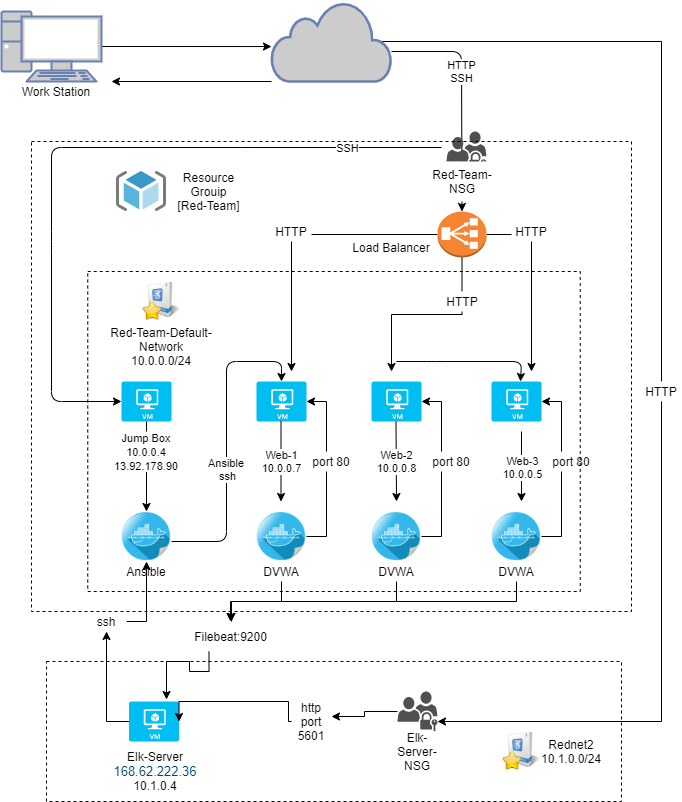

## Automated ELK Stack Deployment

The files in this repository were used to configure the network depicted below.


These files have been tested and used to generate a live ELK deployment on Azure. They can be used to either recreate the entire deployment pictured above. Alternatively, select portions of the YML file may be used to install only certain pieces of it, such as Filebeat.

- [install-elk.yml](https://github.com/manifestjp/Project-1/blob/main/Ansible/install-elk.yml.txt)
- [filbeat-playbook.yml](https://github.com/manifestjp/Project-1/blob/main/Ansible/filebeat-playbook.yml.txt)
- [metricbeat-playbook.yml](https://github.com/manifestjp/Project-1/blob/main/Ansible/metricbeat-playbook.yml.txt)

This document contains the following details:
- Description of the Topology
- Access Policies
- ELK Configuration
  - Beats in Use
  - Machines Being Monitored
- How to Use the Ansible Build


### Description of the Topology

The main purpose of this network is to expose a load-balanced and monitored instance of DVWA, the D*mn Vulnerable Web Application.

Load balancing ensures that the application will be highly available, in addition to restricting access to the network.
Load balancers help to stability of the environment through distribution of incoming data to the web servers. Jump boxes allow for easier administration of mulitple systems and they help create another layer protecting assets from the outside.

Integrating an ELK server allows users to easily monitor the vulnerable VMs for changes to the event logs and system metrics.

- Filebeat watches for specific log files or log directories.

- Metricbeat collects metrics from services on the server and from the system.

The configuration details of each machine may be found below.

| Name       | Function | IP Address | Operating System |
|------------|----------|------------|------------------|
| Jump Box   | Gateway  | 10.0.0.1   | Linux            |
| Web-1      | Sever    | 10.0.0.7   | Linux            |
| Web-2      | Sever    | 10.0.0.8   | Linux            |
| Web-3      | Sever    | 10.0.0.5   | Linux            |
| ELK Server |Log Server| 10.1.0.4   | Linux            |

### Access Policies

The machines on the internal network are not exposed to the public Internet. 

Only the Jump Box Provisioner machine can accept connections from the Internet. Access to this machine is only allowed from the following IP addresses:

- Personal IP address.

Machines within the network can only be accessed by the Jump Box Provisioner machine.

- I allowed my personal IP address to access the Elk Machine through port 5601.

A summary of the access policies in place can be found in the table below.

| Name          | Publicly Accessible | Allowed IP Addresses |
|---------------|---------------------|----------------------|
| Jump Box      | Yes                 | Personal IP          |
| Load Balancer | Yes                 | Open                 |
| Web-1         | No                  | 10.0.0.7             |
| Web-2         | No                  | 10.0.0.8             |
| Web-3         | No                  | 10.0.0.5             |
| ELK Server    | Yes                 | Personal IP          |

### Elk Configuration

Ansible was used to automate configuration of the ELK machine. No configuration was performed manually, which is advantageous because it allows for...

- The main advantage of automating configuration with Ansible is that it makes it easy for system installations and updates across multiple machines easily and negates any mistakes made by manual processes.

The playbook implements the following tasks:

- Installs docker.io, pip3, and the docker module.
```bash
---
- name: Configure Elk VM with Docker
  hosts: elk
  remote_user: redadmin
  become: true
  tasks:
    # Use apt module
    - name: Install docker.io
      apt:
        update_cache: yes
        force_apt_get: yes
        name: docker.io
        state: present

      # Use apt module
    - name: Install python3-pip
      apt:
        force_apt_get: yes
        name: python3-pip
        state: present

      # Use pip module (It will default to pip3)
    - name: Install Docker module
      pip:
        name: docker
        state: present
```
- Increases virtual memory.
```bash
# Use command module
    - name: Increase virtual memory
      command: sysctl -w vm.max_map_count=262144
```
- Uses sysctl module.
```bash
 # Use sysctl module
    - name: Use more memory
      sysctl:
        name: vm.max_map_count
        value: '262144'
        state: present
        reload: yes
```
- Downloads and launches The Docker container for the ELK server.
```bash
      # Use docker_container module
    - name: download and launch a docker elk container
      docker_container:
        name: elk
        image: sebp/elk:761
        state: started
        restart_policy: always
        # Please list the ports that ELK runs on
        published_ports:
          - 5601:5601
          - 9200:9200
          - 5044:5044
```
 

The following screenshot displays the result of running `docker ps` after successfully configuring the ELK instance.


### Target Machines & Beats
This ELK server is configured to monitor the following machines:

- Web-1 (10.0.0.7)

- Web-2 (10.0.0.8)

- Web-3 (10.0.0.5)

We have installed the following Beats on these machines:

- Filebeat

- Metricbeat

These Beats allow us to collect the following information from each machine:

- Filebeat monitors the log files or locations that you specify, collects log events, and forwards them either to Elasticsearch or Logstash for indexing. An example of those types of logs would be Vistitors by OS which shows which OS the visitors are using by percentage.

- Metricbeat collects metrics and statistics from the system. One example is memory usage which is used to track total memory available, what is in use and what is free.

### Using the Playbook
In order to use the playbook, you will need to have an Ansible control node already configured. Assuming you have such a control node provisioned: 

SSH into the control node and follow the steps below:

- Copy the configuration file in your Ansible container to your Web VM's.

- Update the /etc/ansible/hosts file to include the IP addresses of the webservers and ELK Server.

- Run the playbook, and navigate to http://[ELK_Server_public_IP]:5601/app/kibana to check that the installation worked as expected.

- _Which file is the playbook? Where do you copy it? The filebeat-config.yml. It is copied to /etc/ansible/files/filebeat-config.yml.

- _Which file do you update to make Ansible run the playbook on a specific machine? How do I specify which machine to install the ELK server on versus which to install Filebeat on?_ Update filebeat-config.yml. You can specify by updating the host files with the IP addresses of the Web and ELK servers and selecting in ansible which group to run on.

- _Which URL do you navigate to in order to check that the ELK server is running? http://[ELK-Server-public-IP]:5601/app/kibana

_As a **Bonus**, provide the specific commands the user will need to run to download the playbook, update the files, etc._

### Follow these instructions from your Jump box:


- Run the command "curl https://github.com/manifestjp/Project-1/blob/main/Ansible/install-elk.yml > /etc/ansible/roles/install-elk.yml"

- Edit the hosts file in /etc/ansible and add your priviate IP address for your ELK server:
```bash
[elk]
[private-IP-address-for-elk-server] ansible_python_interpreter=/usr/bin/python3
```

- Run the playbook with "ansible-playbook /etc/ansible/roles/install-elk.yml"

- To check if the installation worked type this into your browser "http://[your_elk_server_ip]:5601/app/kibana" and if it was installed correctly you will be at the Kibana home page.

<p align="center">
  
</p>
